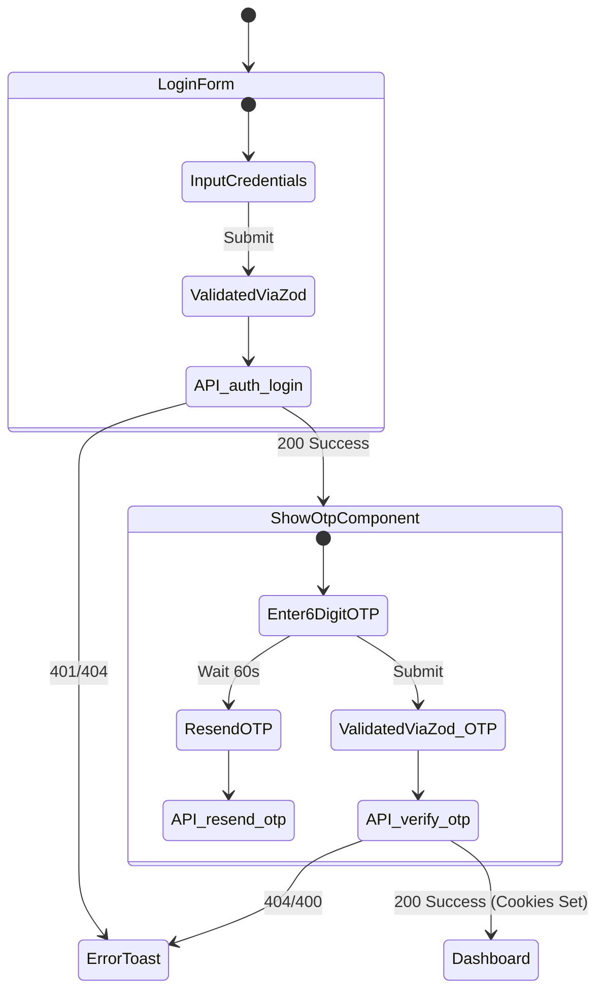
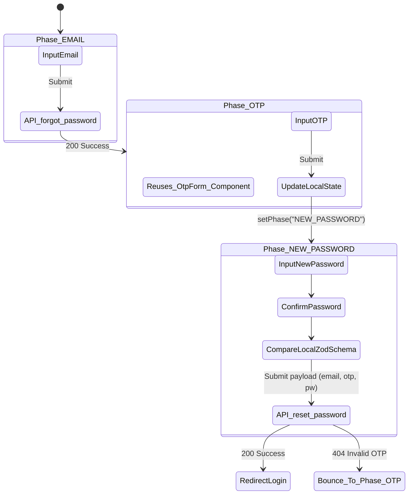

# Frontend Authentication Flow

This document visualizes the user interfaces, state management, and routing logic constructed across the `app/(client)/auth` frontend directory. 

## 1. Architecture & Component Tree

```text
app/(client)/auth
│
├── /register
│    └── Collects name, email, password -> redirects or waits for verification
│
├── /verify-email/[token]
│    └── Extracts URL token -> POST /api/auth/verify-email -> auto logs user in or redirects
│
├── /login 
│    ├── Phase 1 UI: Email & Password Form (Card)
│    └── Phase 2 UI: OtpForm Component (Rendered conditionally on success)
│
└── /forgot-password
     ├── Phase 1 UI (EMAIL): Enter Email
     ├── Phase 2 UI (OTP): OtpForm Component
     └── Phase 3 UI (NEW_PASSWORD): Set & Confirm New Password
```

## 2. Component Logic & State Flows

### A. Login Component Flow (`/auth/login`)
Standard authentication process combining password verification with custom 2FA (Two Factor Authentication) via email OTP.



### B. Forgot Password Flow (`/auth/forgot-password`)
A multiphase form encapsulated in a single file utilizing local `phase` React state to transition the user seamlessly.



## 3. Key Frontend Standardizations
- All forms use **`react-hook-form`** mapped to zod resolvers (`@hookform/resolvers/zod`).
- Form structure strictly adheres to the robust UI **`shadcn`** elements (Card, FieldGroup, Input, Button).
- Shared components (like `<OtpForm />`) exist to maintain visual layout uniformity across the Login and Password Reset verification states.
- Toasts (`sonner`) handle all UX feedback states globally.
