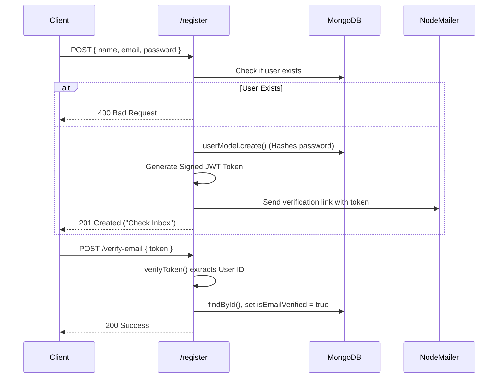
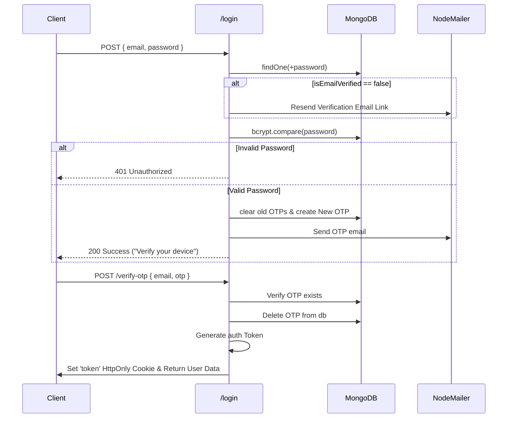
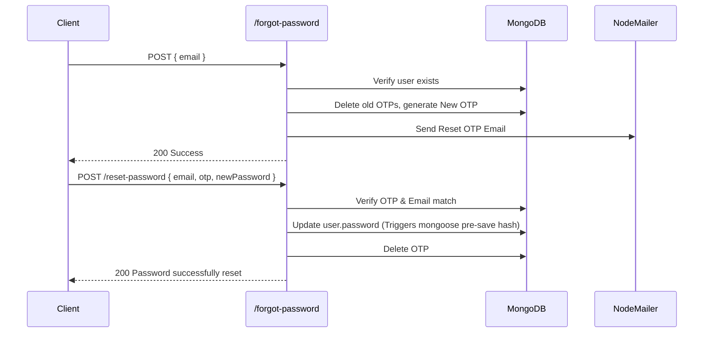

# Backend Authentication Flow

This document visualizes the entire execution logic and data flow across the `app/api/auth` endpoints. 

## 1. Directory Structure

```text
app/api/auth
│
├── /register          -> Creates user, sends email verification link
├── /verify-email      -> Decodes token, marks user as emailVerified
├── /login             -> Authenticates password, sends OTP to email
├── /verify-otp        -> Validates OTP, issues JWT Token cookies
├── /resend-otp        -> Re-issues fresh OTP for login/reset
├── /forgot-password   -> Validates user exists, sends OTP to email
└── /reset-password    -> Validates OTP & saves the new password hash
```

## 2. API Logical Flow Diagrams

### A. Registration & Email Verification Flow


### B. Standard Login (2FA / OTP) Flow


### C. Forgot / Reset Password Flow


## 3. Database Models Interaction
- **user.model**: Handles `pre("save")` hooks to salt & hash passwords with `bcrypt.compare` methods attached.
- **otp.model**: Acts as a transient 2FA store. Every time a new OTP is requested via login, forgot-password, or resend-otp, previous records for that email address are `deleteMany()`'d.
